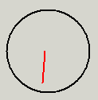



## Radar Screen In Visual Basic

### Description

This code could be used in games or whatever, to create a radar screen. It could also be used for a second hand timer, or something.
 
### More Info
 
First put a circle on your form. It has to be a perfect circle. Then put two lines on the form. Call one 'dummy' and the other 'real_line'. The dummy line's y2 should be half of the circle's height plus the circle's top. The x2 should be the same as the circle's left property. The x1 should be the sum of the circle's left property plus the circle's width property. The y1 property should make a 45* angle from (x2,y2). The real_line line center should be right in the center of the circle. The other end doesn't matter.

-I have upload an example for a little bit of help - sorry for the bad expl.

             |
---                |---
**Submitted On**   |2003-01-26 13:03:40
**By**             |[Adam K](https://github.com/Planet-Source-Code/PSCIndex/blob/master/ByAuthor/adam-k.md)
**Level**          |Intermediate
**User Rating**    |4.7 (14 globes from 3 users)
**Compatibility**  |VB 5\.0, VB 6\.0
**Category**       |[Graphics](https://github.com/Planet-Source-Code/PSCIndex/blob/master/ByCategory/graphics__1-46.md)
**World**          |[Visual Basic](https://github.com/Planet-Source-Code/PSCIndex/blob/master/ByWorld/visual-basic.md)
**Archive File**   |[Radar\_Scre1534871262003\.zip](https://github.com/Planet-Source-Code/adam-k-radar-screen-in-visual-basic__1-42695/archive/master.zip)

